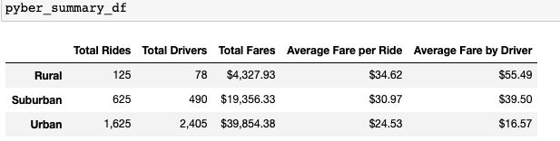
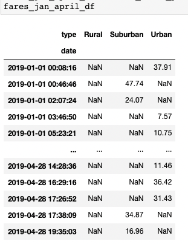
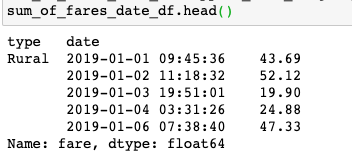
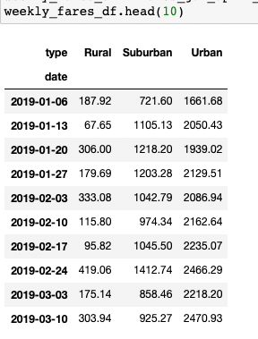
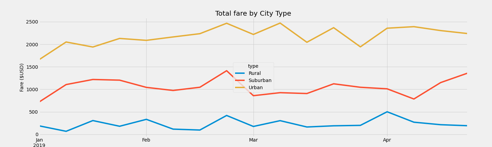

# PyBer_Analysis
- Performing an exploratory analysis and creating visualizations using rideshare data to help improve access to rideshare services and determine affordability for underserved areas.

# Overview of the analysis:
- PyBer Analysis project is to create a summary Dataframe of the ride-sharing data by city type. Using Python skills, Pandas data is analysized and presented using Matplotlib to create multiple-line graph to show total weekly fares for each city.

# Results:
### Pyber Summary DataFrame provides an overview comparison of Pyber's ridesharing services in three types of cities:
- Rural
- Urban
- Suburban

- ### Below is the PyBer Summary Data for all three city types. The summary demonstrates that there is a larger demand for PyBer among riders and drivers in urban cities compared to suburban and rural cities. 
    - Urban cities have larger demand for Pyber riders and drivers.

    - Urban city Average fare per ride is low compared to Suburban and Rural city.

    - Rural city has the highest Average fare per driver.

    - Suburban has average total rides and drivers compared to Urban City.

    - Urban city has the highest revenue since it has highest rides. 

- ### Created Pivot table DataFrame based on give date '2019-01-01' : '2019-04-29'. In the celss where there is no fare for the row that cell was filled with NaN (Not a Number).

- ### Inspect Datatype for the "Datetime" index

- ### Created DataFrame on Weekly basis to get the sum of Fares for each week using resample() function method.   

- ## Pyber Fare Summary Multiple-Line Chart created using Matplotlib:

- Summary Results:
    - There is a larger use of PyBer ridesharing in urban cities.
    - Between mid-February and mid-March there are highest total fares for each city type showing increased demand at that time.
    - Urban cities has earned highest revenue in March.
    - Suburban city there is an increase in fares in mid-February and toward the end of April.
    - There are more drivers in urban cities than rural cities.
    - As a result, the majority of PyBer's revenue occurs in urban cities.
    - On the other hand, the costs for using PyBer is greater among riders in rural cities than urban cities. This could discourage potential riders from using PyBer given the high average fare per ride.

## Based on the results, three business recommendations to the CEO for addressing any disparities among the city types are:

- Drivers in rural cities are earning more than drivers in urban cities. This could demotivate drivers from Urban and Suburban cities working with PyBer.
- Further analysis to determine other factors that are contributing to the high ride costs in rural cities and low driver fares in urban cities can discontinue services in Rural areas.
- Incentives and marketing strategies needs to be applied in Rural cities like make rides at affordable prices, more ride-sharing incentives to encourage to use the services.
- Similarly, Suburban cities needs to be encouraged compared to Urban cities.
